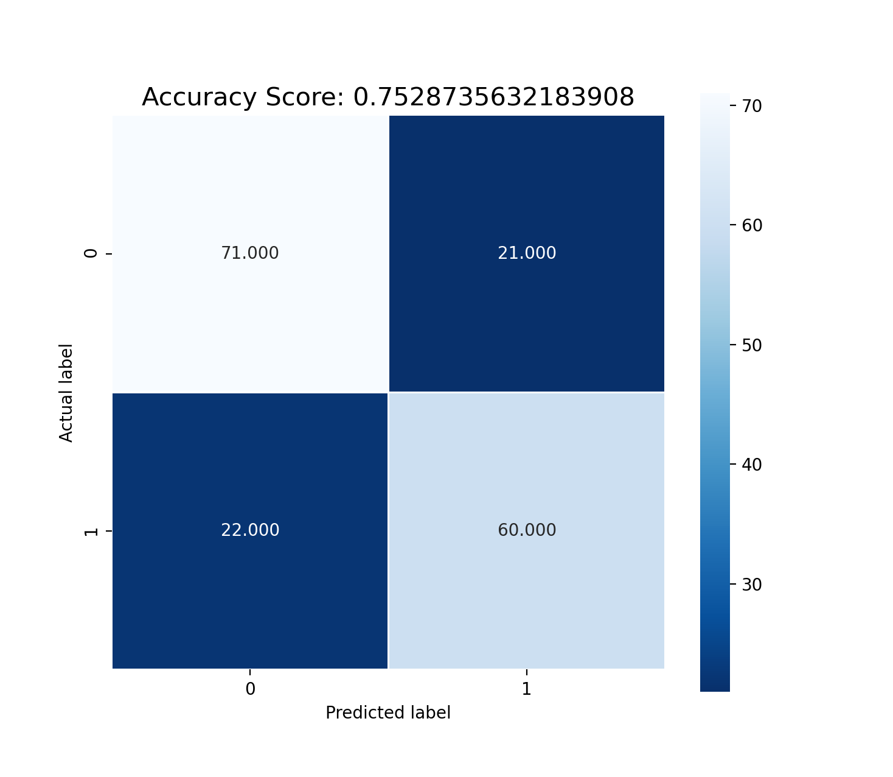

## NLP Quick Task - Machine Translation 
This is my solution to the quick task created by Professor Artzi as part of the application for Independent Study with the LIL Lab. 

## Summary
For this problem, I used two different models to tackle the binary classification task: Support Vector Machine (SVM) and Logistic Regression. For data pre-processing, I first extracted the training and testing data from the **.txt** files. Each training/testing sample has the following properties:
- Source (Chinese)
- Reference (Professional Translation)
- Candidate (Candidate Translation)
- BLEU (Bilingual Evaluation Understudy) Score
- Label (Ground Truth)

For training both models, I used two features as input: BLEU Score and Cosine Similarity. This is based on my intuition on how humans can approach this binary classification task: we are likely to categorize the candidate based on how "natural" or "similar" it is to natural human language. The BLEU Score and Cosine Similarity are two different measures that capture this idea of "similarity" to human language. 

After training both models, I evaluated their respective classification accuracies on the testing data as well as their F1 Scores. I achieved the following results:
- SVM: Accuracy = 74.14%, F1 = 0.7169811320754716
- Logistic Regression: Accuracy = 75.29%, F1 = 0.7361963190184049

Both models seem to perform equally well, with the logistic regressor performing a little bit better.


## Packages/Libraries Used
- [Sklearn](https://scikit-learn.org/stable/)
- [Numpy](https://numpy.org/)
- [NLTK](https://www.nltk.org/)
- [Matplotlib](https://matplotlib.org/)
- [Seaborn](https://seaborn.pydata.org/)

## File Structure

The runnable python code in this project are stored as follows:

```
.
├── extract.py
├── logistic_regression.py
├── svm.py
├── train.txt
└── test.txt
```

## Code Samples 

**extract.py** is used to parse through the training/testing files. The **extract** function returns a list of dictionaries, with each element representing a specific training/testing sample.

```
def extract(filename):
	data = []
	f = open(filename, "r")
	raw = f.read()
	paragraph_split = raw.split('\n\n')
	for example in paragraph_split:
		sample = {}
		line_split = example.splitlines()
		for i, line in enumerate(line_split):
			if i == 0:
				sample["source"] = line
			if i == 1:
				sample["reference"] = line
			if i == 2:
				sample["candidate"] = line
			if i == 3:
				sample["bleu"] = line
			if i == 4:
				sample["label"] = line
		data.append(sample)
	np_data = np.array(data)
	return np_data
```

The dictionary for each sample has the following format:

```
{
	"source" : source,
	"reference": reference,
	"candidate": candidate,
	"bleu": bleu,
	"label": label
}
```

In **logistic_regression.py**, the **cosine_similarity** function computes the cosine similarity measure between two texts. 

```
def cosine_similarity(x,y):
	# tokenization 
	X_list = word_tokenize(x)  
	Y_list = word_tokenize(y)   
	l1 =[];l2 =[]  
	X_set = set(X_list)
	Y_set = set(Y_list)
	# form a set containing keywords of both strings  
	rvector = X_set.union(Y_set)  
	for w in rvector: 
	    if w in X_set: l1.append(1) # create a vector 
	    else: l1.append(0) 
	    if w in Y_set: l2.append(1) 
	    else: l2.append(0) 
	c = 0
	# cosine formula  
	for i in range(len(rvector)): 
	        c+= l1[i]*l2[i] 
	cosine = c / float((sum(l1)*sum(l2))**0.5) 
	return cosine
```

The main section of the code are the **logistic_regressor, predict, accuracy, f1score, classify, plot_cm, and plot** functions. 

```
def logistic_regressor_train(clf):
	train_data_x, train_data_y = build_train("train.txt")
	clf.fit(train_data_x, train_data_y)
	return clf

def predict(clf):
	test_data_x, test_data_y = build_test("test.txt")
	predicted = []
	for sample in test_data_x:
		proc_sample = np.array([list(sample)])
		print(proc_sample)
		pred = clf.predict(proc_sample)[0]
		predicted.append(pred)
	return predicted, test_data_y

def accuracy(ground_truth, prediction):
	total = len(ground_truth)
	correct = 0
	for i in range(total):
		if ground_truth[i] == prediction[i]:
			correct += 1
	return float(correct)/total

def f1score(ground_truth, prediction, average='macro'):
	return f1_score(ground_truth, prediction)

def classify():
	clf = LogisticRegression()
	clf = logistic_regressor_train(clf)
	pred, ground_truth = predict(clf)
	print(pred)
	acc = accuracy(ground_truth,pred)
	print("The % Accuracy is: " + str(float(acc*100)) + "%")
	print("The F1 Score computed using Sklearn is: " + str(f1score(ground_truth, pred)))
	X, Y = build_train("train.txt")
	cm = metrics.confusion_matrix(ground_truth, pred)
	print(cm)
	plot_cm(acc, cm)
	# plot(X, Y, clf)

def plot_cm(acc, cm):
	plt.figure(figsize=(9,9))
	sns.heatmap(cm, annot=True, fmt=".3f", linewidths=.5, square = True, cmap = 'Blues_r')
	plt.ylabel('Actual label')
	plt.xlabel('Predicted label')
	all_sample_title = 'Accuracy Score: {0}'.format(acc)
	plt.title(all_sample_title, size = 15)
	plt.show()


def plot(X,Y,clf):
	# Plot the decision boundary. For that, we will assign a color to each
	# point in the mesh [x_min, x_max]x[y_min, y_max].
	font = {'weight' : 'bold',
	'size'   : 14}
	plt.rc('font', **font)
	ax = plt.gca()
	x_min, x_max = X[:, 0].min() - .5, X[:, 0].max() + .5
	y_min, y_max = X[:, 1].min() - .5, X[:, 1].max() + .5
	h = .02  # step size in the mesh
	xx, yy = np.meshgrid(np.arange(x_min, x_max, h), np.arange(y_min, y_max, h))
	Z = clf.predict(np.c_[xx.ravel(), yy.ravel()])
	# Put the result into a color plot
	Z = Z.reshape(xx.shape)
	plt.figure(1, figsize=(4, 3))
	plt.pcolormesh(xx, yy, Z, cmap=plt.cm.Paired, shading="auto")
	# Plot also the training points
	plt.scatter(X[:, 0], X[:, 1], c=Y, edgecolors='k', cmap=plt.cm.Paired)
	plt.xlabel('Bleu Score (Feature 1)')
	plt.ylabel('Cosine Similarity (Feature 2)')
	plt.xlim(xx.min(), xx.max())
	plt.ylim(yy.min(), yy.max())
	plt.title("Logistic Regression Decision Boundary Fitted on Training Data")
	plt.xticks(())
	plt.yticks(())
	plt.show()

```

A similar explanation follows for **SVM.py**. 

## Results

I decided to show the results for logistic regression, as it performed better (although slightly) than the SVM. The decision boundary fitted on the training data as well as the confusion matrix are shown below. In the decision boundary image, orange dots represent machine translation and blue dots represent human translation. In the confusion matrix image, the label "0" represents human translation and the label "1" represents machine translation. Overall, the majority of testing data were classified correctly. There were 22 "M" labels classified incorrectly as "H" and 21 "H" labels classified incorrectly as "M". 




## Credits
The original problem proposed in this short task was created by Professor Artzi. 

## License
MIT © [Robin Lin]()
